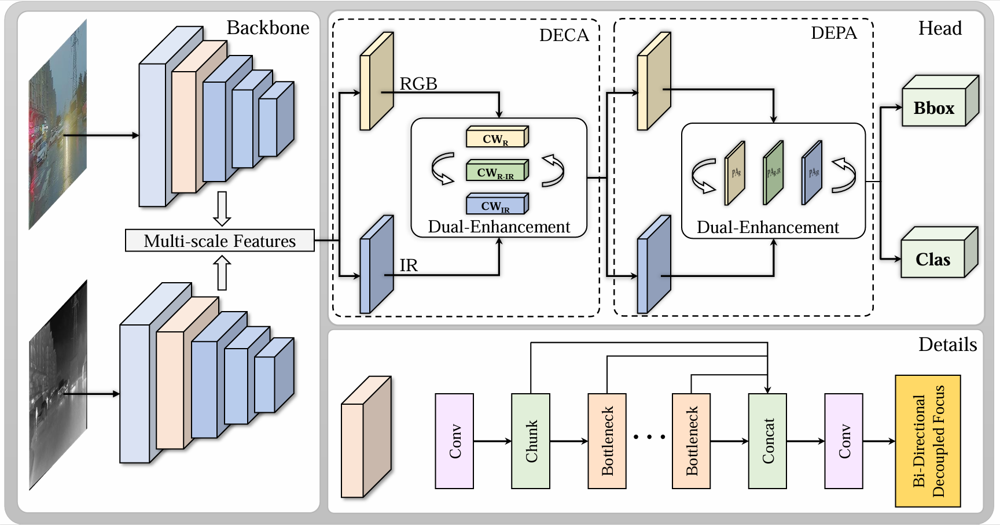
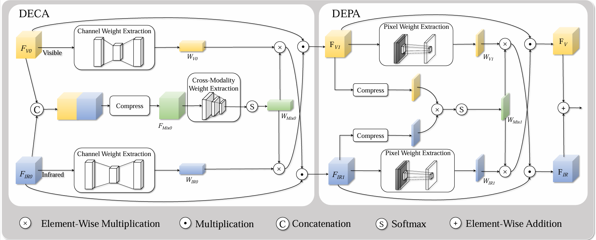
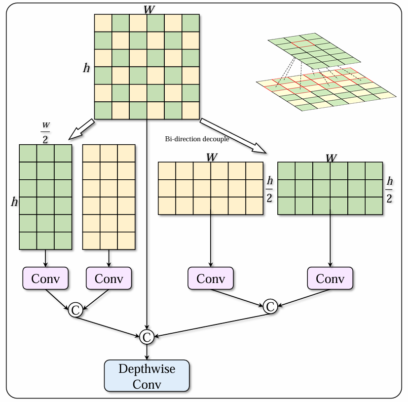
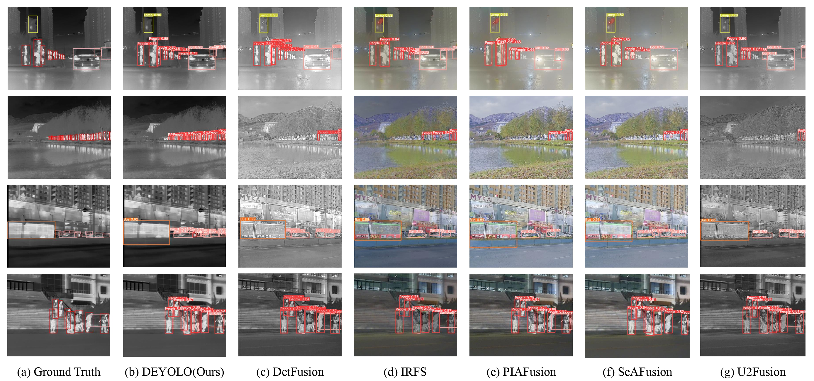
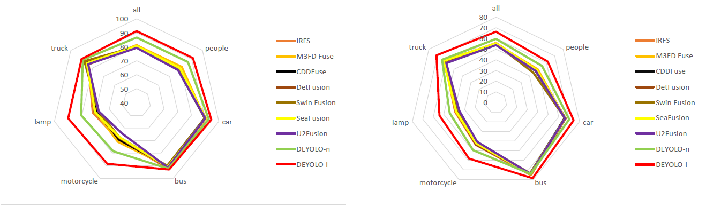

# <div style="text-align: center;">DEYOLO: Dual-Feature-Enhancement YOLO for Cross-Modality Object Detection</div>

---

<h4 align="center">Yishuo Chen<sup>1</sup>, Boran Wang<sup>1(wangbr1025@gmail.com)</sup><a href="mailto:wangbr1025@gmail.com">✉️</a>, Xinyu Guo<sup>1</sup>, Wenbin Zhu<sup>1</sup>,  
Jiasheng He<sup>1</sup>, Xiaobin Liu<sup>1</sup>  and Jing Yuan<sup>1,2,3</sup> </h4>
<h4 align="center">1.College of Artificial Intelligence, Nankai University </h4>
<h4 align="center">2.Engineering Research Center of Trusted Behavior Intelligence, Ministry of
 Education, Nankai University </h4>
<h4 align="center">3.Tianjin Key Laboratory of Intelligence Robotics, Nankai University </h4>

This repository is the code release of the paper *"DEYOLO: Dual-Feature-Enhancement YOLO for Cross-Modality Object Detection"*. Pattern Recognition. ICPR 2024.

- [*[ArXiv]*](https://arxiv.org/abs/2412.04931)

---

## Introduction 

We design a dual-enhancement-based cross-modality object detection network DEYOLO, in which a semantic-spatial cross-modality module and a novel bi-directional decoupled focus module are designed
 to achieve the detection-centered mutual enhancement of RGB-infrared
 (RGB-IR). Specifically, a dual semantic enhancing channel weight assignment module (DECA) and a dual spatial enhancing pixel weight assignment module (DEPA) are firstly proposed to aggregate cross-modality
 information in the feature space to improve the feature representation
 ability, such that feature fusion can aim at the object detection task.
 Meanwhile, a dual-enhancement mechanism, including enhancements for
 two-modality fusion and single modality, is designed in both DECA and
 DEPA to reduce interference between the two kinds of image modalities.
 Then, a novel bi-directional decoupled focus is developed to enlarge the
 receptive field of the backbone network in different directions, which improves the representation quality of DEYOLO.

## Document
### Recommended Environment

- [x] torch 1.13.0
- [x] torchvision 0.14.0
- [x] numpy 1.25.0

```python
conda create -n yolov8 python=3.9
pip install pypi
pip install torch==1.13.0+cu117 torchvision==0.14.0+cu117 torchaudio==0.13.0 --extra-index-url https://download.pytorch.org/whl/cu117
pip install -e .
```

### Train
You can choose DEYOLO's n/s/m/l/x model in [DEYOLO.yaml](./ultralytics/models/v8/DEYOLO.yaml)

```python
from ultralytics import YOLO

# Load a model
model = YOLO("ultralytics/models/v8/DEYOLO.yaml").load("yolov8n.pt")

# Train the model
train_results = model.train(
    data="M3FD.yaml",  # path to dataset YAML
    epochs=100,  # number of training epochs
    imgsz=640,  # training image size
    device="cpu",  # device to run on, i.e. device=0 or device=0,1,2,3 or device=cpu
)
```

### Predict

```python
from ultralytics import YOLO

# Load a model
model = YOLO("DEYOLOn.pt") # trained weights

# Perform object detection on RGB and IR image
model.predict([["ultralytics/assets/vi_1.png", "ultralytics/assets/ir_1.png"], # corresponding image pair
              ["ultralytics/assets/vi_2.png", "ultralytics/assets/ir_2.png"]], 
              save=True, imgsz=320, conf=0.5)
```

## Dataset
Like [M3FD.yaml](./ultralytics/yolo/cfg/M3FD.yaml) and [LLVIP.yaml](./ultralytics/yolo/cfg/LLVIP.yaml) You can use your own dataset.

<details open>
  <summary><b>File structure</b></summary>

```
Your dataset
├── ...
├── images
|   ├── vis_train
|   |   ├── 1.jpg
|   |   ├── 2.jpg
|   |   └── ...
|   ├── vis_val
|   |   ├── 1.jpg
|   |   ├── 2.jpg
|   |   └── ...
|   ├── Ir_train
|   |   ├── 100.jpg
|   |   ├── 101.jpg
|   |   └── ...
|   ├── Ir_val 
|   |   ├── 100.jpg
|   |   ├── 101.jpg
|   |   └── ...
└── labels
    ├── vis_train
    |   ├── 1.txt
    |   ├── 2.txt
    |   └── ...
    └── vis_val
        ├── 100.txt
        ├── 101.txt
        └── ...
```

</details>

You can download the dataset using the following link:
- [M3FD](https://github.com/JinyuanLiu-CV/TarDAL)
- [LLVIP](https://github.com/bupt-ai-cz/LLVIP)

## Pipeline
### The framework
<div align="center">
  
</div>

 We incorporate dual-context collaborative enhancement modules (DECA and DEPA) within the feature extraction
 streams dedicated to each detection head in order to refine the single-modality features
 and fuse multi-modality representations. Concurrently, the Bi-direction Decoupled Focus is inserted in the early layers of the YOLOv8 backbone to expand the network’s
 receptive fields.

### DECA and DEPA
<div align="center">
  
</div>

DECA enhances the cross-modal fusion results by leveraging dependencies between
channels within each modality and outcomes are then used to reinforce the original
single-modal features, highlighting more discriminative channels.  

DEPA is
able to learn dependency structures within and across modalities to produce enhanced
multi-modal representations with stronger positional awareness.

### Bi-direction Decoupled Focus
<div align="center">
  
</div>

We divide the pixels into two groups for convolution.
Each group focuses on the adjacent and remote pixels at the same time.
Finally, we concatenate the original feature map in the channel dimension and
make it go through a depth-wise convolution layer.

## Visual comparison
<div align="center">
  
</div>

## Main Results
<div align="center">
  
</div>

 The mAP<sub>50</sub> and mAP<sub>50−95</sub> of every category in M<sup>3</sup>FD dataset demonstrate the superiority of our method.
 
 Trained Weights：
 - [M3FD](https://pan.baidu.com/s/1fZx0UjFcyTfRqZfgKRSZgA?pwd=3016)
 - [LLVIP](https://pan.baidu.com/s/1rw5qdCbvLTlcREoAsNMRXw?pwd=3016)
 - [Kaist](https://pan.baidu.com/s/1b-NO4lteXK-TwSTBrGuXsQ?pwd=3016)


## Citation
If you use this code or ideas from the paper for your research, please cite our paper:
```
@InProceedings{Chen_2024_ICPR,
    author    = {Chen, Yishuo and Wang, Boran and Guo, Xinyu and Zhu, Senbin and He, Jiasheng and Liu, Xiaobin and Yuan, Jing},
    title     = {DEYOLO: Dual-Feature-Enhancement YOLO for Cross-Modality Object Detection},
    booktitle = {International Conference on Pattern Recognition},
    year      = {2024},
    pages     = {}
}
```

## Acknowledgement
Part of the code is adapted from previous works: [YOLOv8](https://github.com/ultralytics/ultralytics/releases/tag/v8.1.0). We thank all the authors for their contributions.
